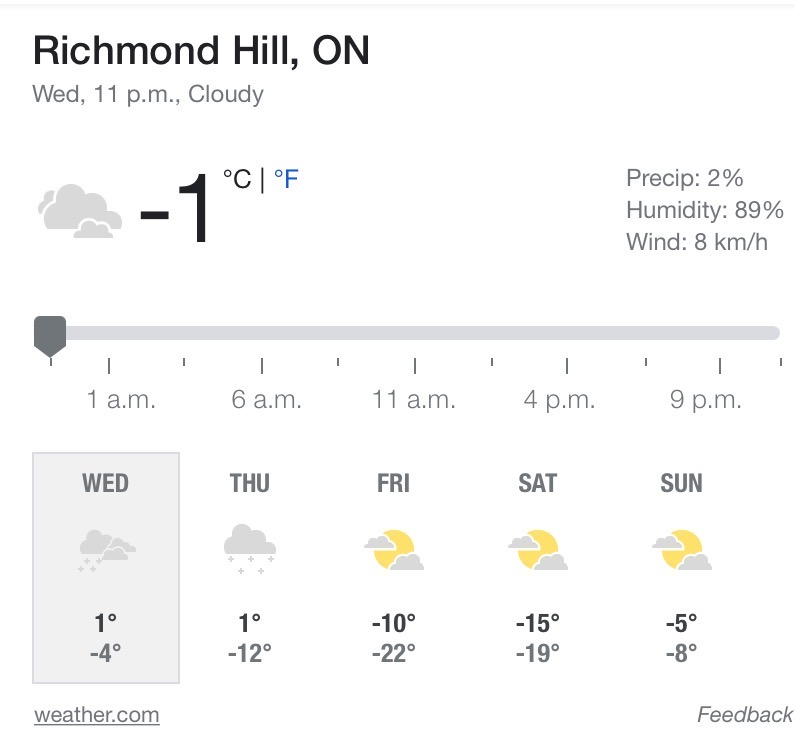
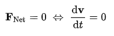
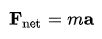
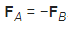
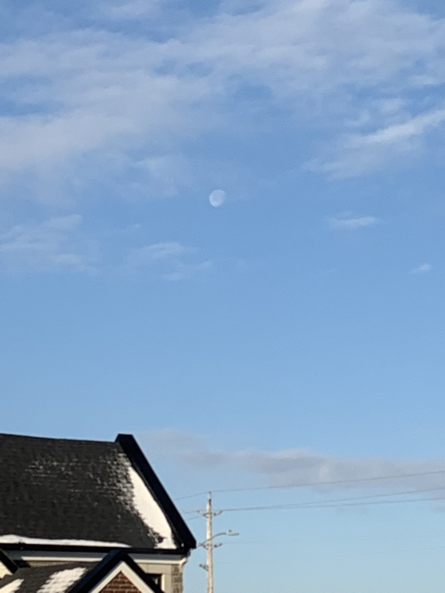
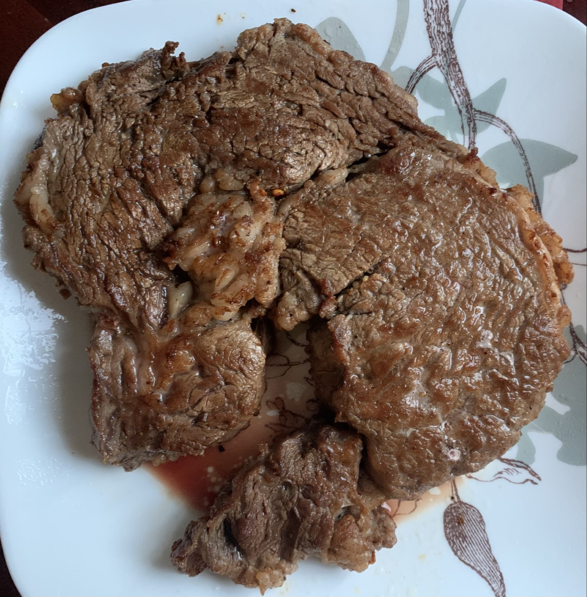

# My Poems

## 2022-01-12




```dos
燕归来 • 22112跑步

我凝视大雁
大雁也在凝视我？

我看大雁飞翔
大雁看我跑步?

前几天零下三十度
你们飞到南方去了吗？

今天刚刚转到零度
你们就飞回北方了吗？

我看天气预报
后天大后天又是零下二十度
你们还会飞去南方吗？

我是有多想
配速能够和你们一样

有一天可以
临时中午跑到伦敦喂一下午鸽子
当晚再跑回大约克

身体虽然不能像你们那样自由
但是思想早已飞向宇宙
我们已经派出了JWST
等待着一个声音
不要回答
不要回答
不要回答
```

## 2021-12-26







```
突然在忙碌的节奏中停下，
莫名地感到失落甚至负罪，
这 ，就是牛顿第一定律！

付出越多，
收获越大，
这 ，就是牛顿第二定律！

我多爱家人，
家人也多爱我，
这 ，就是牛顿第三定律！
```

## 2021-12-22



```
一轮明月天地幽
前任豪宅后任收
后人收了莫欢喜
还有收人在后头
```

## 2021-12-14


```
四目相对 竟无语凝嫣
强牛三千 只取一条饮
```

## 2021-12-12

```
天上半月
地下半马
恰逢双十二
天气很不错
本来只是想来个十六公里
突然想为啥不多来几千米
荷包蛋加牛排
在机场等飞船
打破无数记录
收获几许 P B
20.00
20.21
20.22
21.098
```





## 2021-12-10

```
踏雪有痕
飞天无限
```


## 2021-12-01


[Happy Birthday Effie](https://docs.google.com/presentation/d/1fIUYhVYISEGLjEpSACpGsjgdmLjieAIFGSqscSmAhbE/edit?usp=sharing)

```
爱某人

小女儿一年中最喜欢的一天！
特意新装一百多射灯
老天爷也送个大晴天
不跑个十公里真地过意不去
撸起袖子做个她最喜欢的家常菜
在电脑上轻车熟路地做个 deck 给她
另外手写几张贺卡
再包上一个大大的生日礼物
换来她满满的幸福感
能够有一个女人这么爱和被爱
也是多么难得，感动和幸福 😅
你知道我的梦
你知道我的痛
你知道我们感受都相同
就算有再大的风
也挡不住勇敢的冲动
努力的往前飞
再累也无所谓
黑夜过后的光芒有多美
分享你我的力量
就能把对方的路照亮 👍🏻
```

## 2021-11-29


```
上联 拎包入住
下联 提桶跑路
横批 踏山河
```

## 2021-11-28


```
下雪岂能无诗
上酒更加有益
天上掉蛋糕掷地无数
地下造玉人擎天一柱
```

## 2021-11-22


冷月无声，白雪飘飘，最是寂寞深秋夜

热血有情，彩霞菲菲，总为繁忙残冬日

<!-- Not working -


Not working -
<video width="320" height="240" controls>
  <source src="image/2021/20211122_sunset.mov" type="video/mp4">
</video> -->

<video style="width:50%" controls src="image/2021/20211122_sunset.mov">
</video>

_Works in VSC but not in GitHub_

## 2021-11-19


```
600 年不遇的大红月亮全食
2021 的最后一个 eclipse
气温零下天气阴冷
还好足并不需出户
一点左右大圆盘
晴空万里白云飘飘
四点多一片昏黑
阴森诡异汗毛倒竖
前后大血红蛋白
壮观绚丽知乎过瘾
六点多回大白圆
略加思索奋笔疾书
导出月球体积计算公式 😅
```

## 2021-11-17


```
秋夜月 \* 学

年少不知有难事
只把科学当第一
青春乱花渐入眼
东奔西走好迷失

不觉早已步中年
子女长大如从前
惊觉曾阅书万卷
奈何初心只等闲

朝阳红火夕亦赢
何言放弃任庸平
可将剩勇酬壮志
青史不枉有此行
```

### Comment

诗人回顾了童年的幸福时光 感受到了曾经经历过中年的迷失 因为孩子教育 突然发现原来曾经掌握了很多高薪技术 岁月催人老 聊发少年狂 立志此生能够做出一番事业

## 2021-11-14


```
沁园春 \* 初雪

都说要不忘初心，
那么你记住初雪了吗？
虽然每年都会来，
可是你不知道它哪天出现。
即使有天气预报，
然而到底有多大，多急，多壮观，
能够持续多久，
对大家有什么影响，
总还是不那么清楚。
至少对于冬天出生的人来说，
真的是有那么一丝期待，
一分兴奋，
还有一道喜悦的。
```

```
Qinyuan Spring. Early Snow

They all said that they should not forget their original intentions,
So do you remember the first snow?
Although I will come every year,
But you don't know when it will appear.
Even if there is a weather forecast,
But how big, urgent, and spectacular,
How long can it last,
What impact does it have on everyone,
It's still not so clear.
At least for people born in winter,
There is really such a glimmer of expectation,
A bit excited,
There is also a joy.
```

## 2021-11-12


```
上一分钟还是风雨癫痫
下一秒就已经白云蓝天
管住嘴
迈开腿
融入大自然
快步奔跑在幸福的人间
```

### 2021-11-07


```
立冬风景宜人
竟然有十六度
争渡争渡
惊见鹅粪无数
```

### 2021-10-30


```
斜风蒙蒙
细雨霏霏
五十功名尘与土
八千里路云和月
```

### 2021-09-28


My first Sonnet

我的第一首十四行诗

```
致敬莎翁

你是英语中成就最高的文豪 没有之一
你一己之力把文学戏剧表演提升到新的高度
你有四大喜剧 四大悲剧 流芳百世
你还是思想家哲学家艺术家 万年难遇

你的十四行诗多达一百五十四个
你的金句数不胜数 淋漓酣畅
你的台词通俗易懂 却又意义深刻
你的思想跨越时空 源远流长

你竟然还是一个精明的企业家
你财务自由 生意兴隆 置业购地
你可以专心创作 无需忙碌养家
你留下无数宝贵遗产 实乃后人幸事

你是如何做到这一切的 如此了不起
非常感谢四百多年前 世界曾经有你
```

### 2021-06-xx

Slightly drunk
Time for a poem
(1000 words omitted)

```
My brain wanted to focus on Java
My heart dreamed to be an SME in one day
Unfortunately my body disagreed

They said there is a will where there is a way
People believed practice made perfect
I am going to challenge this
Because why not

I didn’t like cooking
I never thought about that
Since many people can do it
How come you can’t
```

### 2021-05-16


```
假如
你看到了路边一朵鲜艳的野花
不要犹豫
采就是了

万一
你发现了树上一颗丰满的蟠桃
不要紧张
摘就是了

突然
你找到了身旁一个漂亮的姑娘
不要发呆
白就是了
```
